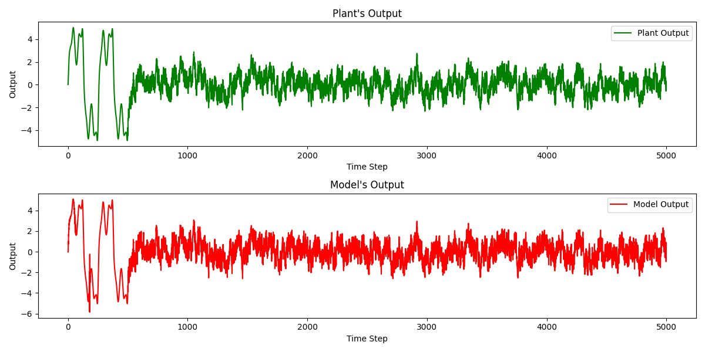
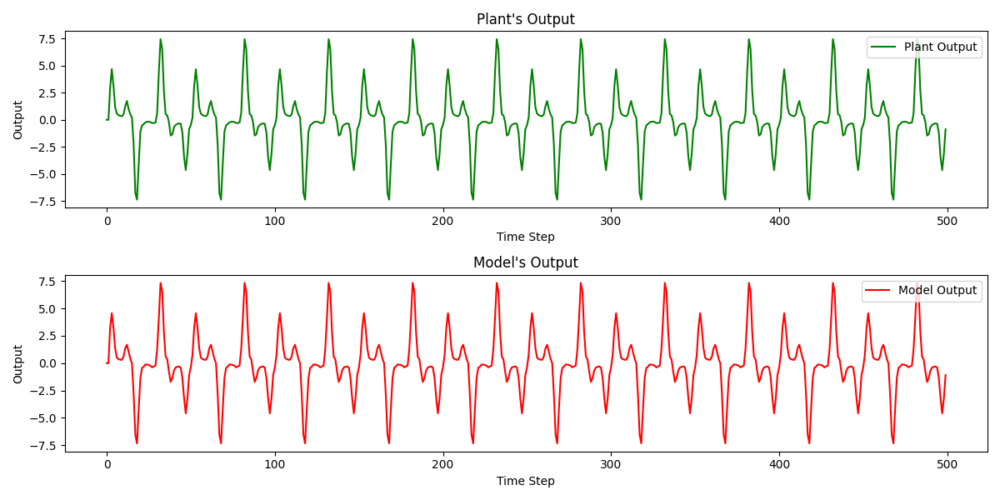

# Nonlinear Plant System Identification Using Neural Networks

## Description

This repository contains implementations of Examples 1 and 3 from the research paper “[Identification and Control of Dynamical Systems Using Neural Networks](https://maxim.ece.illinois.edu/teaching/fall20/final/Narendra90.pdf)” by KUMPATI S. NARENDRA and KANNAN PARTHASARATHY. 
The "plant" in this context represents a nonlinear dynamical system whose exact behavior is unknown or partially unknown, who is governed by a difference equation that relates the next output to its previous time steps. 
These examples demonstrate using neural networks to approximate the plant’s behavior, enabling us to model and predict its response to various inputs.

## Results

Below are the results for examples one and three, showing the neural network’s output in comparison to the expected plant behavior:

### Example 1
The network accurately approximates the plant’s response, with the output closely matching the expected behavior over time.



### Example 3
In Example 3, a more complex nonlinear system is modeled, demonstrating the network's ability to adapt to complex plant dynamics.



### Installation

1. Clone this repository to your local machine:
    ```bash
    git clone https://github.com/markshperkin/DynamicNN.git
    ```

2. Navigate into the project directory:
    ```bash
    cd DynamicNN
    ```

3. Install the required packages:
    ```bash
    pip install -r requirements.txt
    ```

## Usage

### 1. Example One

This file will train the model and show an evaluation plot.

```bash
python example01.py
```
### 2. Example Three

This file will train the model and show an evaluation plot.

```bash
python example03.py
```

## Class Project

This project was developed as part of the Neural Network class under the instruction of [Professor Vignesh Narayanan](https://sc.edu/study/colleges_schools/engineering_and_computing/faculty-staff/narayanan_vignesh.php) at the University of South Carolina.
